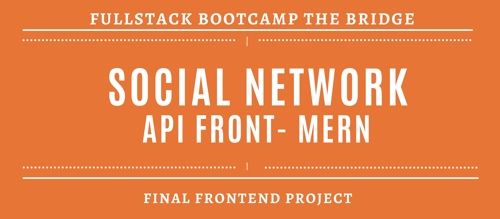

# Introducción

Proyecto individual final del sprint de Frontend en el que se combinan los conocimientos adquiridos en el stack MERN.

## Descripción del proyecto

He desarrollado un frontend con las siguientes funcionalidades:

- Registro y login de usuarios.
- Vista de posts de todos los usuarios en la frontpage.
  - PostDetail de cada uno de ellos.
- Like/dislike en posts y comments.
- Visionado del perfil de usuario junto con sus posts, followers, following, capacidad de editar posts propios, y más.
- Buscador y filtrado de posts.
- CRUD completo de posts
- Responsive.
- Subida de imágenes a través de Cloudinary.

## Tecnologías y librerías utilizadas

- Frontend

  - React-Redux – Biblioteca principal para construir la interfaz de usuario.

  - React Router DOM – Enrutamiento en aplicaciones SPA.

  - Ant Design (AntD) – Librería de componentes UI.

  - Axios – Cliente HTTP para consumir APIs.

  - Sass – Preprocesador CSS para estilos más organizados y escalables.

- Herramientas de desarrollo
  - Vite – Herramienta rápida para desarrollo y build de aplicaciones frontend.

## Instalación

⚠️ **Atención:**

#### Backend

Este proyecto consume una API disponible [aquí](https://github.com/PaulaVegas/Proyecto_RedSocial.git)

#### Frontend

1. Clona este proyecto
2. Instala dependencias `npm i`
3. Levanta el proyecto con `npm run dev`

## Demo del producto

_próximamente_
